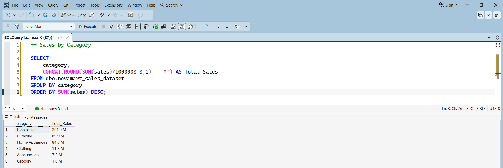
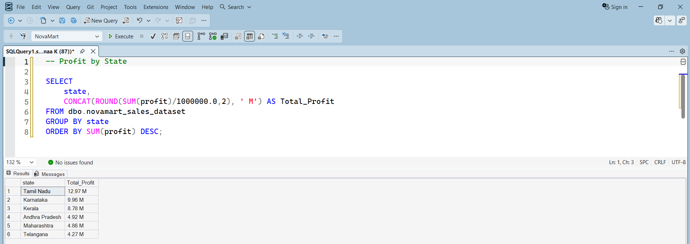
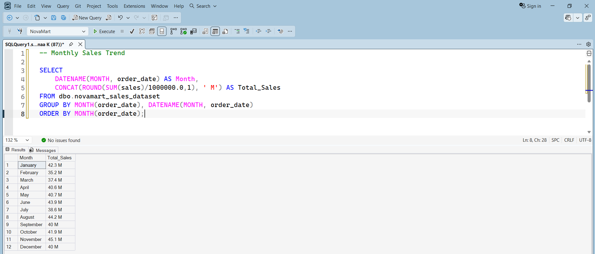
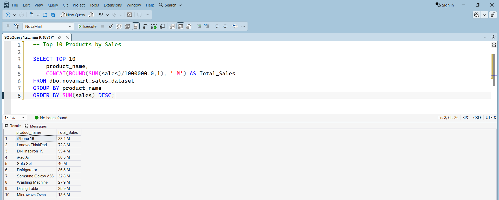
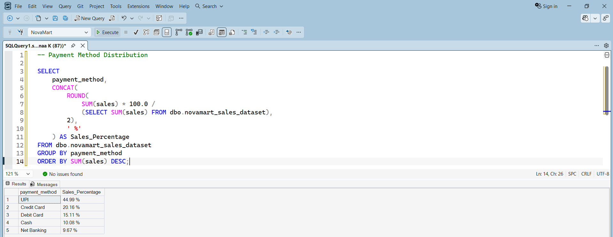

# 🛒 NovaMart Retail Analytics Dashboard


An end-to-end Retail Sales Analytics project demonstrating the complete data analytics workflow—from generating a realistic retail dataset with Python to performing SQL analysis, Exploratory Data Analysis (EDA), and building an interactive Power BI dashboard for business decision-making.

---

# 📌 Project Overview

NovaMart is a fictional retail company created to simulate a real-world business environment.

The objective of this project is to transform raw sales data into meaningful business insights using Python, SQL Server, and Microsoft Power BI.

The project covers the complete analytics lifecycle:

- 📊 Dataset Generation using Python
- 🧹 Data Preparation
- 📈 Exploratory Data Analysis (EDA)
- 💻 SQL Business Analysis
- 📉 Interactive Power BI Dashboard
- 📋 Business Insights & Reporting

---

# 🛠️ Tools & Technologies

| Tool | Purpose |
|------|---------|
| Python | Dataset Generation & Data Analysis |
| Pandas | Data Cleaning & Manipulation |
| NumPy | Numerical Operations |
| Matplotlib | Data Visualization |
| SQL Server (SSMS) | Business Queries & Analysis |
| Power BI | Interactive Dashboard Development |
| Power Query | Data Transformation |
| DAX | Measures & KPIs |

---

# 📂 Repository Structure

```
NovaMart-Retail-Analytics
│
├── Dashboard Screenshots
├── Dataset
├── Power BI
├── Python
├── Python Charts
├── SQL
├── SQL_Screenshots
└── README.md
```

---

# 📊 Power BI Dashboard

## Executive Overview


---

## Sales Analysis


---

## Product Analysis


---

## Customer Analysis


---

## Regional Analysis


---

# 📈 Exploratory Data Analysis (EDA)

The dataset was explored using Python (Pandas & Matplotlib) to identify trends and patterns before building the dashboard.

## Monthly Sales Trend


---

## Category Sales


---

## Regional Profit


---

## Payment Method Distribution


---

# 💻 SQL Business Analysis

SQL Server was used to answer important business questions and generate insights from the dataset.

## Sales by Category



---

## Profit by State



---

## Monthly Sales Trend



---

## Top Products by Sales



---

## Payment Method Distribution



---

# 📂 Dataset

The dataset was **generated entirely using Python** to simulate a realistic retail sales environment.

It includes information such as:

- Order ID
- Order Date
- Customer Name
- Product Name
- Category
- State
- Quantity
- Sales
- Profit
- Discount
- Payment Method

---

# 📌 Key Business Insights

- 📈 Electronics generated the highest sales.
- 💳 UPI was the most preferred payment method.
- 🏆 Tamil Nadu contributed the highest overall profit.
- 📅 Monthly sales remained relatively stable throughout the year.
- ⭐ Premium electronic products generated the highest revenue.

---

# 🚀 Future Improvements

- Add predictive sales forecasting using Machine Learning.
- Deploy the Power BI dashboard online.
- Automate data refresh using SQL and Power BI.
- Expand the dataset with multiple years of sales.

---

# 👩‍💻 Author

**Rathnaa K**

Aspiring Data Analyst

### Skills

- Power BI
- SQL
- Python
- Pandas
- Excel
- Data Visualization
- Business Intelligence

---

⭐ If you found this project useful, consider giving it a star!
